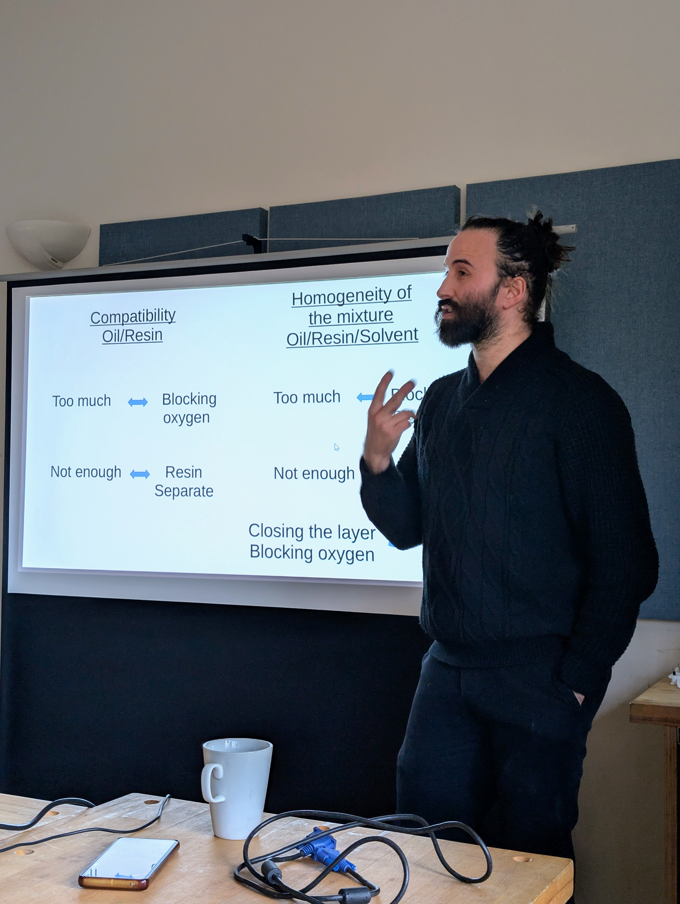
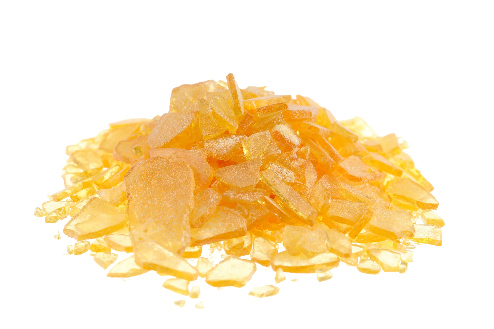
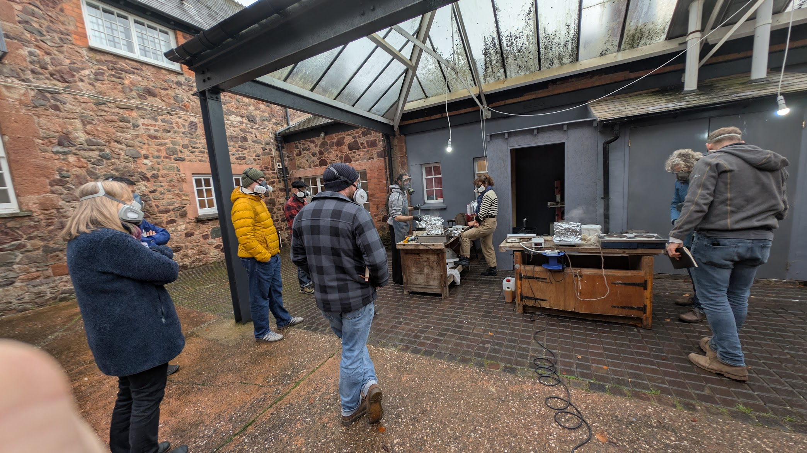
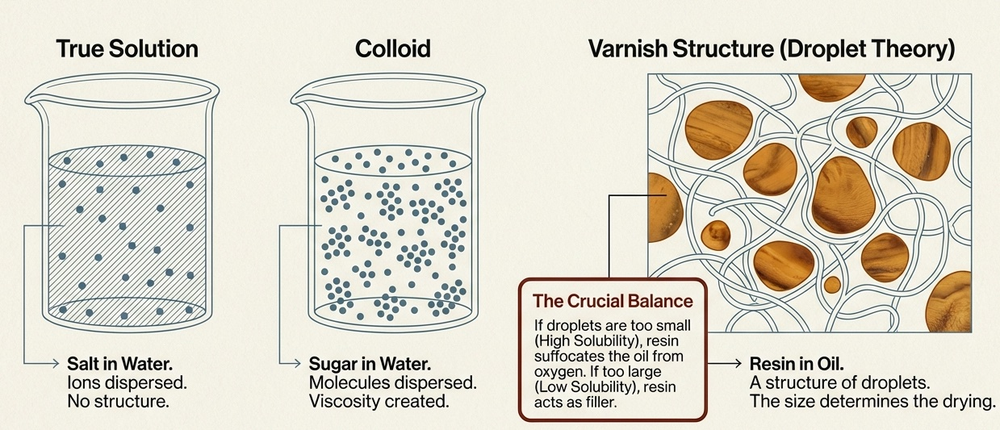
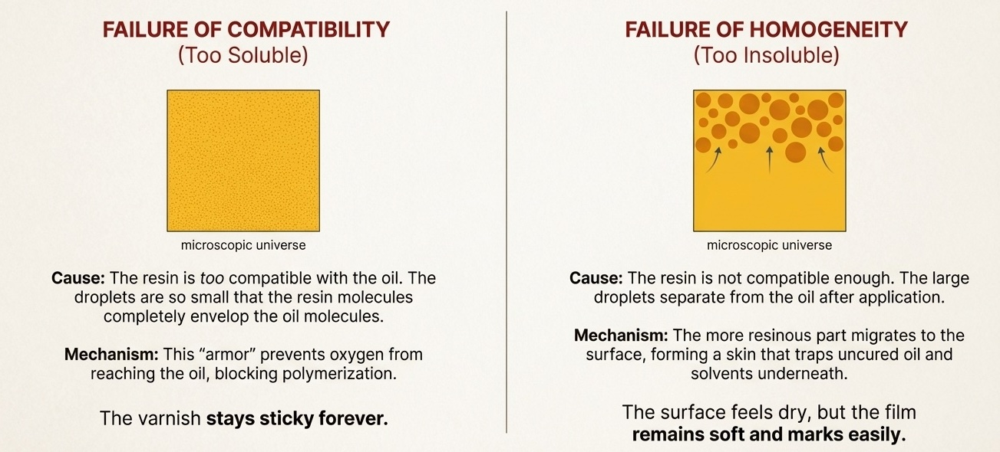
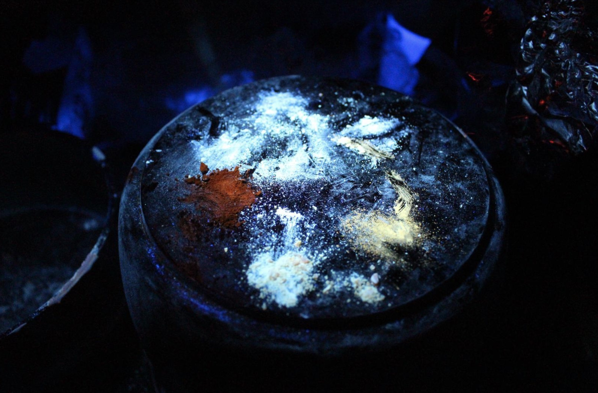
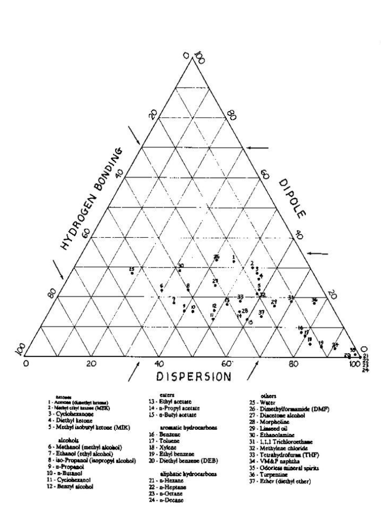
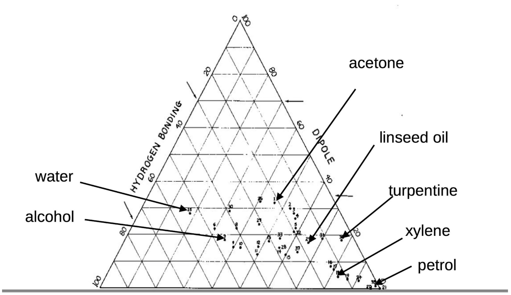
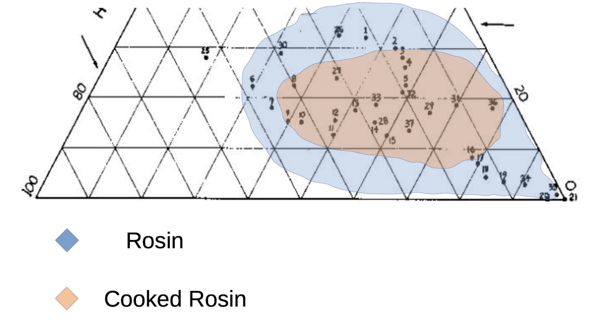
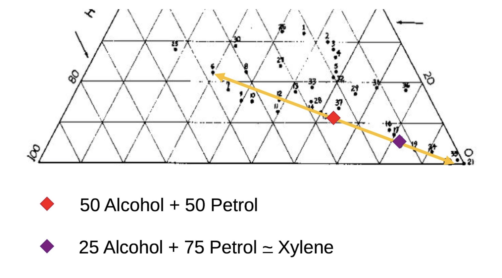

# Varnish making with colophony
### A quick overview of 7 days with Pierre Flavetta
### Paul Fremantle
---

# Pierre Flavetta 

- A **genius** of varnish, antiquing, and more!!
- BVMA Course December 2026

---

# Why colophony varnish?

- Colophony is a resin - the result of drying pine sap
- Before colophony, makers used simply drying oils
  - Historically never formed a very hard surface 
- For Strad and Amati, colophony varnish was available and cheaper than other resins 
  - Used extensively until the late 1700s

---

# Historical context
-   **Early Era (Pre-1680):** Makers like Amati used very **light, clear colophony** bases.
-   **Transition (1680–1730):** Stradivari introduced an **orange-based system** combining dark colophony, iron oxides (hematite), and red lakes.
-   **Late Era (Post-1730):** Makers shifted almost entirely to **dark colophony bases**, likely because lighter bases were unreliable and prone to drying failure.
- **Colophony Declines (1800s onward):** Shift to spirit varnish

---

# Resins

| Resin | The Challenge | Untreated Result | Goal |
| :--- | :--- | :--- | :--- |
| **Colophony** (Pine, Spruce) | Naturally **too soluble** in oil. | Creates a varnish that will stay sticky forever. | Must be cooked correctly (*lots more coming*) |
| **Amber** (Fossilized Resin) | Naturally **insoluble** in oil. | Will not mix with oil at all. | Must be cooked at high temperatures (pyrogenized) to become soluble. 
| **Sandarac** (Juniper, Cedar) | Naturally **insoluble** in oil. | Will not mix with oil. | Must be cooked for a specific time/temp (e.g., 3 hours at 270°C) to become soluble. |
| **Mastic** (Pistacia Tree) | Behaves like colophony (**too soluble**). | (Similar to colophony). | Can be used as a **"siccative"** to add solubility back into a varnish that has been made *too insoluble*. |
---

# Why do we use colophony?

- It is hard to get right 
  - (That is why they gave up)
- Difficult and hazardous to process

... *but*

- Widely available
- Historically Authentic
  - Great for antiquing
- Beautiful when done right

---
 

---

# The basic process

- Cook a drying oil (e.g **linseed**) for a few hours 
- Cook **colophony resin** for some amount of time (*will be explained later*)
- Mix the two together in a specific proportion with heat to create a varnish
- Potentially use a **solvent** to thin the varnish

#### These steps can be done separately and over time
- Save cooked colophony and oil
- Cook them more

---

# Optional extras

- **Bubble air** through the oil while cooking or instead of cooking
- Add **metal salts** to the oil (dryers)
- Cook colophony with a **lid** on
- Add metal salts to the colophony (to create *rosinates*)
- Add colour compounds and metal salts to the **oil** *or* **colophony** *or* **varnish**
  - **For another lecture!** (*too much for today*)

---

# Why do we cook oil?

- We need the oil to **polymerise** (aka drying)
- Start the polymerisation 
  - Between 1-3 hours
  - 230°C - 250°C 
- Too little oxygen or too much heat (more than 270°C)
  - **Stand oil**
  - Fully polymerised and sludgy

---

# Resin should **not** dissolve in oil
If it is too soluble it prevents the oil polymerising

---

# Cooking

- Cooking linseed oil is actually *optional*
  - It won't dry as well but will eventually dry
- Cooking colophony is **essential**
  - colophony is **too soluble**
  - Need to reduce the solubility to ensure the colloid is created
  - Adding 7-9% **Lime** (*Calcium Hydroxide*) creates a calcium rosinate which reduces solubility as well

---

# The challenge of colophony = the goldilocks cook

---

# Cooking colophony
-   **Under 240°C:** Activates **oxidation**, making the resin darker and more insoluble.
-   **Above 240°C:** The resin begins to **decompose** (crack), creating "resin oils" that can cause permanent stickiness.
-   **Open vs. Closed Pan:** Cooking in an open pan allows acidic fumes and resin oils to escape, while a lid keeps them inside, increasing acidity. 
- **Closed Pan** - actually kitchen foil with a hole to allow some escape 

  - Increases action and makes **more insoluble**
  - You may need to heat for 30 mins without a lid and blowing hot air to remove the resin oils

---

## The secret to cooking colophony - check under UV light

---

## UV 365nm high intensity torch
- Crumble to a powder
- Blue / white - uncooked
- Yellow - starting to oxidise
- Orange - great
- Brown - too insoluble

---

## Mixing the oil and cooked colophony
  - Add the oil to melted colophony
    - **220°C-240°C for 30m - 1hr**
    - Stay below 270°C!
  - 60% oil / 40% colophony 
    - "long oil" / fat
    - liquid, resistant to chipping
  - 60% colophony / 40% oil
    - ("short oil" / lean)
    - Chippy and hard - great for antiquing
  - 50% / 50% - a good starting point

---

# The solvent triangle

Source: https://uk.pinterest.com/pin/449445237791288763/

## Teas Diagram
- A way of representing solvents that is useful
- I don't understand the chemistry but will explain the approach

---

# The solvent triangle

---

# Understanding colophony solubility

---

# Mixing solvents - just find the right spot on the line

---

# Pierre's approach to solvents

- Turpentine as a default
- Although white spirit evaporates more quickly in isolation, the better the solvent the slower the evaporation
- Shellsol D70 is a heavier petrol you can also use
- Spike Oil (Lavender oil from spikes) is very effective
- Methoxypropanol is super-effective - go carefully

---

# Summary / Recap

- **Colophony varnish** was the authentic choice for Strad and Amati
- The challenge: colophony is **too soluble** - must be cooked to reduce solubility
- **Cook oil** (1-3 hrs, 230-250°C) to start polymerisation
- **Cook colophony** carefully - check under **UV light** (orange = great)
- **Mix** at 220-240°C: start with 50/50 ratio
  - More oil = flexible; more colophony = hard (good for antiquing)
- **Solvents**: turpentine default, use Teas diagram to find alternatives

### The goldilocks principle: not too soluble, not too insoluble!